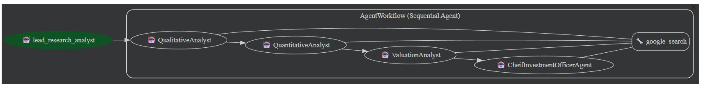
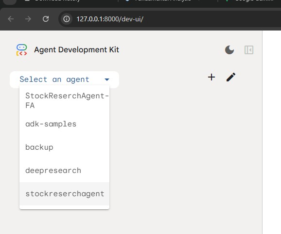

# Stock Research Agent - Multi-Agent AI Framework for Fundamental Analysis

## 📋 Project Overview

The **Stock Research Agent** is an advanced AI-powered framework designed to automate and systematize the fundamental analysis of publicly traded companies. Built on Google's Agent Development Kit (ADK), this project demonstrates the capabilities of multi-agent orchestration to conduct comprehensive financial analysis across three critical dimensions: qualitative assessment, quantitative screening, and valuation analysis.

This framework transforms the methodologies from **Zerodha's Varsity Fundamental Analysis Module** into an intelligent, structured agent-based workflow that provides investors with detailed, citation-backed research reports.

### Project Objectives

- **Automate Financial Analysis**: Streamline the fundamental analysis process using intelligent agents
- **Ensure Transparency**: Provide fully cited and sourced analysis with complete traceability
- **Maintain Quality Control**: Implement multi-gate approval system to validate business quality before deeper analysis
- **Enable Decision Making**: Deliver executive-level investment recommendations grounded in conservative value investing principles
- **Demonstrate AI Capabilities**: Showcase how multi-agent systems can handle complex, real-world financial tasks

---

## 🏗️ Project Architecture

### Core Technology Stack

| Component | Technology | Purpose |
|-----------|-----------|---------|
| **LLM Model** | Gemini 2.5 Pro | Advanced reasoning for financial analysis |
| **Framework** | Google Agent Development Kit (ADK) | Multi-agent orchestration and management |
| **Primary Tool** | Google Search | Real-time data retrieval (news, filings, reports) |
| **Language** | Python 3.x | Implementation language |
| **Data Sources** | Annual Reports, Stock Exchanges (NSE/BSE), Financial Filings | Primary data inputs |

### Agent Architecture Overview

The system implements a **Sequential Multi-Agent Architecture** with hierarchical gating:

```
┌─────────────────────────────────────────────────────────────────┐
│                  ORCHESTRATOR AGENT                              │
│         (Head of Research - Manages Workflow)                    │
└──────────────────────────────┬──────────────────────────────────┘
                               │
                    ┌──────────┼──────────┐
                    │          │          │
        ┌───────────▼─┐  ┌────▼────────┐ ┌──────────▼──────────┐
        │   GATE 1    │  │   GATE 2    │ │     GATE 3          │
        │ QUALITATIVE │  │QUANTITATIVE │ │   VALUATION         │
        │   ANALYST   │  │   ANALYST   │ │   ANALYST           │
        │   AGENT     │  │   AGENT     │ │   AGENT             │
        └──────┬──────┘  └────┬────────┘ └──────────┬──────────┘
               │               │                     │
               └───────────────┼─────────────────────┘
                               │
                    ┌──────────▼──────────┐
                    │   CIO AGENT         │
                    │  (Final Synthesis)  │
                    └─────────────────────┘
                               │
                    ┌──────────▼──────────┐
                    │ INVESTMENT DECISION │
                    │  RECOMMENDATION     │
                    └─────────────────────┘
```
Agent Workflow:-



---

## 🤖 Agent Descriptions & Use Cases

### 1. **Qualitative Analyst Agent** (Gate 1: Business Quality Screening)

**Purpose**: The gatekeeper of the analysis pipeline. Assesses the qualitative, non-numeric aspects of a business.

**Key Responsibilities**:
- **Management Integrity Assessment**
  - Analyzes related party transactions for conflicts of interest
  - Evaluates promoter shareholding patterns and pledge status
  - Reviews promoter salary-to-profit ratios
  - Assesses political dependencies or regulatory vulnerabilities
  
- **Business Moat Analysis**
  - Identifies economic moats (brand, pricing power, switching costs)
  - Evaluates competitive positioning and entry barriers
  - Assesses business scalability without linear capex growth
  
- **Annual Report Forensics**
  - Compares management claims with actual business performance
  - Analyzes MD&A (Management Discussion & Analysis) sections
  - Reviews risk disclosures and management commentary on macro trends
  
- **Scuttlebutt & Market Observation**
  - Evaluates product visibility in real-world usage
  - Assesses customer perception and market sentiment
  - Tracks industry trends affecting the company

**Output**: 
- Management Integrity Score (High/Medium/Low)
- Governance Score (High/Medium/Low)
- Moat Strength Assessment (Wide/Narrow/None)
- Red Flags (if any)
- Verdict: **GO** (proceed to next gate) or **NO-GO** (stop analysis immediately)

**Gate Decision Logic**:
- ❌ **NO-GO Triggers**: Fraud, insider dealing, severe governance issues, ethical concerns
- ✅ **GO Triggers**: Sound management, clear moat, acceptable governance standards

**All Claims Are Cited** with specific sources: Annual Reports (page references), Stock Exchange filings, News articles (with URLs and dates)

---

### 2. **Quantitative Analyst Agent** (Gate 2: Financial Health Screening)

**Purpose**: Validates financial robustness through 10-point checklist. Ensures the company has the financial strength to sustain its moat.

**10-Point Checklist Analysis**:

1. **Gross Profit Margin (GPM)** - Is it > 20%? Indicates moat strength
2. **Growth Alignment** - Is Revenue growth consistent with Profit growth?
3. **EPS Growth** - Is EPS growing without equity dilution masking bad performance?
4. **Debt Levels** - Debt-to-Equity < 1 preferred; Interest Coverage healthy?
5. **Inventory Management** - Calculate Inventory Turnover & Days. Red flag if building inventory while sales slow
6. **Receivables Quality** - Calculate DSO (Days Sales Outstanding). Is company pushing credit sales?
7. **Cash Flow Quality** - Is Operating CF positive? Compare CFO vs PAT (critical red flag if PAT+ but CFO-)
8. **Return on Equity** - Is ROE > 18-20%?
9. **Complexity** - Does company have too many subsidiaries creating opacity?
10. **Working Capital Health** - Is working capital turnover sustainable?

**Additional Analyses**:
- **5-Year CAGR Calculation**: Revenue and Profit growth trends
- **DuPont Analysis**: Decompose ROE into Net Profit Margin (Efficiency) × Asset Turnover (Activity) × Financial Leverage (Risk)
- **Cash Flow Trend Analysis**: 5-year operating cash flow pattern
- **Balance Sheet Verification**: Accounting equation integrity (Assets = Liabilities + Equity)

**Output**:
- 10-Point Checklist Score: X/10 (with detailed breakdown)
- CAGR: Revenue and Profit (5-year)
- DuPont Breakdown: (Efficiency %, Activity ratio, Leverage multiplier)
- Cash Flow Verdict: Healthy / Stressed / Manipulated
- Verdict: **PASS** (proceed to valuation) or **FAIL** (stop analysis)

**Gate Decision Logic**:
- ❌ **FAIL Triggers**: 
  - Checklist Score < 6/10
  - Debt-to-Equity > 1.5
  - Negative Operating CF while PAT is positive (earnings quality issue)
  - ROE < 15%
  - Cash Flow Verdict = Manipulated
  
- ✅ **PASS Triggers**: Score ≥ 6/10, healthy debt, positive FCF, acceptable ROE

**All Metrics Are Cited** with specific sources: Annual Reports (year, page), Balance Sheet dates (As of 31-Mar-2024), Cash Flow statement references, Stock Exchange filings

---

### 3. **Valuation Analyst Agent** (Gate 3: Fair Value & Price Assessment)

**Purpose**: Determines intrinsic value and applies margin of safety. Assumes company passed quality and financial gates.

**Relative Valuation Analysis**:
- **P/E Ratio Comparison**: Current vs 3-year historical average vs industry peers vs Nifty 50
- **P/S Ratio**: Price to Sales (useful for cyclical businesses)
- **P/BV Ratio**: Price to Book (useful for financial institutions)
- **Market Context**: Nifty 50 P/E assessment (Overvalued >22x vs Undervalued <16x)

**DCF (Discounted Cash Flow) Valuation**:

1. **Historical FCF Analysis** (5-year):
   - Operating Cash Flow - Capital Expenditure = Free Cash Flow
   - Trend analysis of FCF generation capacity

2. **2-Stage Growth Model Forecast**:
   - **Stage 1 (Years 1-5)**: Conservative growth (max 15-18% for high-growth, lower for stable)
   - **Stage 2 (Years 6-10)**: Tapered growth (typically ~10%)
   
3. **Terminal Value Calculation**:
   - Terminal Growth Rate: Conservative 3-4% MAX (should not exceed long-term GDP growth)
   - Gordon Growth Model: Terminal FCF ÷ (WACC - Terminal Growth Rate)

4. **Discount Rate (WACC) Calculation**:
   - Risk-Free Rate (10-year Government Security yield)
   - Beta (from stock exchange data)
   - Equity Risk Premium (from market analysis)
   - Cost of Debt (from company financials)
   - Tax Rate (from annual reports)
   - WACC = (E/V × Cost of Equity) + (D/V × Cost of Debt × (1 - Tax Rate))

5. **Intrinsic Value Calculation**:
   - NPV of Stage 1 FCF (Years 1-5)
   - NPV of Terminal Value (Years 6+)
   - Enterprise Value = NPV of all FCF + NPV of Terminal Value
   - Equity Value = Enterprise Value + Cash - Total Debt
   - **Intrinsic Value Per Share = Equity Value ÷ Shares Outstanding**

6. **Margin of Safety Application**:
   - Modeling Error Band: ±10% around intrinsic value
   - 30% Discount applied to lower band
   - **Buy Price = Lower Band × (1 - 0.30)**

**Output**:
- Relative Valuation Status: Overvalued / Undervalued vs Peers
- DCF Intrinsic Value: ₹X per share
- Intrinsic Value Band: ₹X - ₹Y (±10%)
- Buy Price (with 30% Margin of Safety): ₹Z per share
- Final Recommendation: **STRONG BUY / BUY / HOLD / SELL**

**Recommendation Logic**:
- 🔥 **STRONG BUY**: Current Price < Buy Price (Great opportunity with safety margin)
- ✅ **BUY**: Current Price within Intrinsic Value Band (Fair value entry point)
- ⏸️ **HOLD**: Current Price 10-20% above Intrinsic Value (Wait for better price)
- ❌ **SELL**: Current Price >20% above Intrinsic Value (Overvalued, avoid)

**All Valuations Are Cited** with specific sources: Current stock price (NSE/BSE, date/time), Historical prices (from market data), Annual Reports (for FCF, debt, shares), Economic forecasts (for growth & discount rates), Industry reports (for peer multiples)

---

### 4. **CIO Agent** (Chief Investment Officer - Final Synthesis)

**Purpose**: Synthesizes all three specialist reports into an executive-level investment decision with clear rationale.

**Decision Hierarchy**:
1. **Evaluate Gate 1 (Qualitative)**: If NO-GO → REJECT entire analysis
2. **Evaluate Gate 2 (Quantitative)**: If FAIL → REJECT entire analysis
3. **Evaluate Gate 3 (Valuation)**: Determine recommendation level (STRONG BUY to SELL)

**Final Investment Summary Components**:
- Executive Summary (2-3 sentences with recommendation)
- Qualitative Pillars (Management, Governance, Moat, Red Flags)
- Financial Health Scorecard (All 10-point metrics)
- Valuation Analysis (DCF, multiples, margin of safety)
- Final Investment Decision & Rationale (3 sentences)
- Risk Warnings & Caveats (Key risks, assumptions to monitor, re-rating catalysts)
- Decision Gates Summary (Visual table of all gate decisions)

**Tone**: Professional, analytical, conservative, capital-preservation focused

---

### 5. **Orchestrator Agent** (Lead Research Analyst)

**Purpose**: Manages the entire workflow sequentially.

**Workflow Logic**:
```
STEP 1: Run Qualitative Analyst
   ├─ If NO-GO → STOP, Issue REJECT
   └─ If GO → Continue to Step 2

STEP 2: Run Quantitative Analyst
   ├─ If FAIL → STOP, Issue REJECT
   └─ If PASS → Continue to Step 3

STEP 3: Run Valuation Analyst
   └─ Generate valuation recommendation

STEP 4: Run CIO Agent
   └─ Synthesize all reports into final investment memo
```

**Resource Management**:
- Avoids wasting computational resources on weak companies
- Early termination if fundamental criteria not met
- Conserves API calls through intelligent gating

---

## 📚 Foundational Methodology

This project is built upon the comprehensive fundamental analysis framework from:

**Source**: [Zerodha Varsity - Fundamental Analysis Module](https://zerodha.com/varsity/module/fundamental-analysis/)

The Zerodha Varsity fundamental analysis series provides the theoretical foundation covering:
- Module 1: Introduction to Fundamental Analysis
- Module 2: Understanding the P&L Statement
- Module 3: Understanding the Balance Sheet
- Module 4: Understanding the Cash Flow Statement
- Module 5: Financial Ratios
- Module 6: The DuPont Analysis
- Module 7: Dupont Analysis – The 10-Point Checklist
- Module 8: Valuation – The Basics
- Module 9: Discounted Cash Flow (DCF) Valuation

**Our Implementation**: We have systematized these methodologies into intelligent agent workflows that:
1. **Automate** the research process while maintaining rigor
2. **Standardize** analysis across companies for consistency
3. **Cite** all sources for full transparency and traceability
4. **Gate** the analysis process to ensure quality control
5. **Synthesize** findings into actionable investment decisions

---

## 📊 Citation & Source Tracking

Each agent incorporates **comprehensive citation and source tracking**:

### Qualitative Agent Citations
- Management claims sourced to Annual Report page numbers
- Governance data linked to Corporate Governance reports
- News claims linked to URLs and publication dates
- Red flags traced to regulatory filings or stock exchange announcements

### Quantitative Agent Citations
- All financial metrics sourced to specific financial statements
- Balance sheet items dated (e.g., "As of 31-Mar-2024")
- 5-year trends show all intermediate years with document references
- CAGR calculations show formula with source years
- Red flags explicitly sourced with calculation methodology

### Valuation Agent Citations
- Current stock price: Exchange, time, date (e.g., "NSE Close: ₹X as of 27-Nov-2025 16:00 IST")
- Historical prices: From market data with specific dates
- Growth rate assumptions: Each tied to management guidance, historical performance, or industry data
- Terminal growth rate: Justified against GDP growth with source
- WACC components: Each element (Rf, Beta, ERP, Rd) individually sourced
- DCF calculation steps: All inputs traceable back to source documents
- Peer selection: Rationale explained and sourced

### Mandatory Reference Tables
Each agent provides comprehensive source tables:
- **Qualitative**: Claim | Source Type | Document | Date Accessed | URL | Reliability Rating
- **Quantitative**: Metric | FY2020-FY2024 | Source Document | URL | Page Reference
- **Valuation**: Input Parameter | Value | Source | Date/Period | URL | Reliability

---

## 🚀 How to Use the Stock Research Agent

### Installation & Setup

1. **Clone the repository**:
   ```bash
   git clone <repository-url>
   cd adk-samples/python/agents/stockreserchagent
   ```

2. **Install dependencies**:
   ```bash
   pip install google-adk
   ```

3. **Configure API Keys in .env file**:
   ```bash
   export GOOGLE_API_KEY="your-google-api-key"
   ```

4. **Run the agent using ADK WEB**:
   ```
    adk web 
   ```
   Open the url :- http://127.0.0.1:8000/dev-ui/ and select the agent folder
   
   
   

### Input Format

Provide the orchestrator agent with a stock ticker or company name:
- "Analyze INFY for investment"
- "Research WIPRO stock"
- "Evaluate HDFC Bank for buying"

### Output Format

The system returns:
1. **Qualitative Analysis Report** (Gate 1)
2. **Quantitative Analysis Report** (Gate 2)
3. **Valuation Analysis Report** (Gate 3)
4. **CIO Investment Memo** (Final synthesis)
5. **Complete Citation Trail** (All sources with links)

### Working Demo Screenshots refer this below file
[Demo Screenshots](./docs/DemoScreenshots.pdf)

---

## ⚠️ IMPORTANT DISCLAIMER

### This Tool Is For Demonstration & Educational Purposes Only

**CRITICAL NOTICE**: The Stock Research Agent is designed to **DEMONSTRATE AI AGENT CAPABILITIES** in financial analysis. It is **NOT** a substitute for professional financial advice, and **SHOULD NOT** be used as the sole basis for investment decisions.

### Key Limitations & Risks

1. **AI Hallucinations & Errors**
   - Large Language Models (LLMs) are prone to generating plausible-sounding but inaccurate data
   - All analysis must be independently verified against original source documents
   - The model may misinterpret financial statements or make calculation errors

2. **Data Quality & Completeness**
   - Source data may be incomplete, outdated, or incorrect
   - Web search results may be misleading or from unreliable sources
   - Historical data may not reflect current market conditions
   - Financial filings may contain errors or revisions not yet reflected

3. **Valuation Assumptions**
   - Growth rate assumptions are inherently uncertain
   - Terminal growth rates and discount rates are subject to significant estimation error
   - DCF models are sensitive to small changes in inputs, potentially leading to vastly different valuations
   - Market conditions, competitive dynamics, and regulatory changes can invalidate assumptions

4. **Market Risk**
   - Past performance does not guarantee future results
   - Stock prices can be affected by unpredictable macro events, market sentiment, and unforeseen crises
   - Even well-analyzed companies can underperform due to execution failures or industry disruptions

5. **Insufficient Human Judgment**
   - Automated analysis lacks the nuance and contextual understanding of experienced analysts
   - The system cannot account for qualitative factors that emerge through deep management interaction
   - AI agents cannot replace human judgment, skepticism, and due diligence

### What This Tool Is NOT

❌ **NOT** financial advice
❌ **NOT** an investment recommendation
❌ **NOT** a replacement for qualified financial advisors
❌ **NOT** a guarantee of returns or protection from losses
❌ **NOT** suitable for making standalone investment decisions
❌ **NOT** appropriate for risk-averse or first-time investors

### What This Tool IS

✅ **IS** an educational demonstration of AI agent capabilities
✅ **IS** a research aid to supplement human analysis
✅ **IS** a framework for systematizing fundamental analysis
✅ **IS** a tool for generating initial screening criteria
✅ **IS** an example of multi-agent orchestration in finance

---

## 📋 MANDATORY STEPS BEFORE USING FOR INVESTMENT DECISIONS

Before acting on ANY recommendation from this system:

1. **Consult a Qualified Financial Advisor**
   - Speak with a Certified Financial Planner (CFP) or registered investment advisor
   - Ensure advisor understands your risk tolerance, investment horizon, and financial goals
   - Get personalized advice based on your complete financial situation

2. **Independent Verification**
   - Download original financial documents from company websites or stock exchange (NSE/BSE)
   - Manually verify all calculations and metrics presented
   - Cross-check valuation assumptions against multiple sources
   - Read full annual reports, not just summaries

3. **Additional Research**
   - Read industry reports from recognized research firms
   - Follow company-specific news from reputable financial media
   - Listen to earnings calls and management presentations
   - Understand competitive positioning within the industry

4. **Risk Assessment**
   - Determine your personal risk tolerance and investment horizon
   - Consider your overall portfolio composition and diversification
   - Account for emergency fund needs and existing obligations
   - Evaluate impact of potential 50%+ loss on your financial security

5. **Tax & Legal Consultation**
   - Consult tax professionals on capital gains implications
   - Understand regulatory requirements and compliance needs
   - Consider impact of holding period on tax efficiency
   - Ensure investment complies with any organizational policies

---

## 🔒 User Responsibility & Accountability

**By using this Stock Research Agent, you acknowledge that:**

- You have read and understood this disclaimer in full
- You understand the limitations and risks outlined above
- You take FULL RESPONSIBILITY for all investment decisions
- You will NOT rely solely on this tool for investment choices
- You will consult qualified professionals before investing
- You accept ALL financial losses from decisions informed by this tool
- You understand that LLMs can and do make mistakes
- You will independently verify all analysis and calculations
- You hold developers and operators harmless for any financial losses

---

## 🤝 Contact & Professional Guidance

### For Investment Decisions, Contact:
- **Registered Investment Advisors** (SEBI registered)
- **Certified Financial Planners** (CFP or equivalent)
- **Wealth Management Professionals**
- **Stock Brokers** (for transaction execution)
- **Tax Consultants** (for tax optimization)

### Regulatory Bodies (India):
- **SEBI** (Securities and Exchange Board of India)
- **Stock Exchanges**: NSE (National Stock Exchange), BSE (Bombay Stock Exchange)
- **Reserve Bank of India** (RBI) - for macro context

### Red Flags - Avoid These:
- ⛔ Anyone guaranteeing investment returns
- ⛔ Unlicensed "financial advisors"
- ⛔ Pressure to invest quickly without due diligence
- ⛔ Tips from social media or unverified sources
- ⛔ "Guaranteed profits" schemes
- ⛔ High pressure sales tactics

---

## 📄 License & Attribution

This project is provided for educational purposes. 

**Attribution**: Built on methodologies from Zerodha Varsity Fundamental Analysis Module

**License**:  Apache 2.0

---

## 🙏 Final Word

This Stock Research Agent represents the frontier of AI in financial analysis. While powerful, it is a **tool**, not a replacement for human judgment. The most successful investors combine quantitative rigor with qualitative insight, market experience, and disciplined risk management.

**Remember**: The best investment is one you fully understand, have thoroughly researched, and can afford to lose.

---

**Last Updated**: November 27, 2025
**Version**: 1.0
**Status**: Educational & Demonstration

---

### Document Version History
| Version | Date | Changes |
|---------|------|---------|
| 1.0 | 27-Nov-2025 | Initial release |
